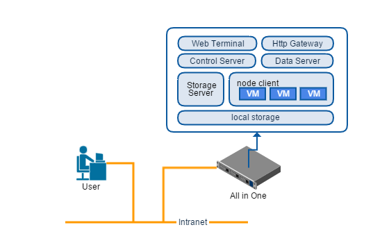
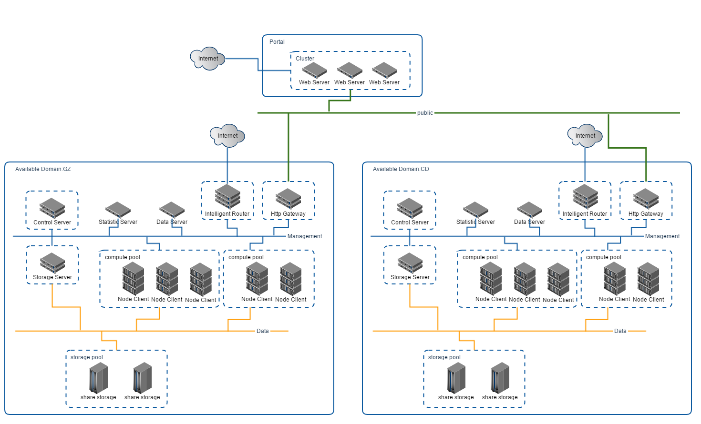

.. intro	.
 
--------
总体简介
--------

概括
====

致云云管理平台是致云科技为了提供高效、简洁的云计算服务而完全自主设计研发的纯软件IaaS平台。

与目前主流的开源云计算产品不同，整套产品采用 **极简理念** 设计，在充分满足客户需求的前提下，简化系统概念，精简部署过程和使用流程，极大地降低了学习难度，缩短了系统和业务上线时间。

平台使用崭新且友好的Html5纯图形化界面进行管理和控制，提供无人值守图形化安装，用户无需学习繁琐的CLI指令和各种模块安装部署指南。

平台的分布式 *Scale-out* 架构，能够灵活部署应对从 *All In One* 最小系统到多地多中心的 *公有云运营* 等各种业务场景，所有平台组件能够自动发现、自动组网，在部署和迁移时，无需人工干预和管理，极大地提高项目实施效率，降低了维护难度和故障率。

全平台核心组件均为 *C++* 开发，最大程度地发挥系统性能，同时杜绝了常见开源组件安全漏洞多，稳定性差的问题。

各组件均为纯软件模块，可以在任意x86服务器上灵活安装，主要组件如下图所示：

.. image:: images/01_component_overview.png

主要组件功能
------------

 
-	**主控节点(Control Server)**:核心组件，为业务请求提供全栈式服务，实现原子式事务控制，管理资源池，监控平台状态

-	**域服务器(Data Server)**:提供域管理及通讯模块注册，协助实现工作域发现、模块关联与自动组网

-	**计算资源节点(Node Client)**:将物理资源虚拟化，作为资源池的一部分，承载云主机实例的组装、运行与控制，同时监控云主机运行状况、采集资源用量

-	**存储服务器(Storage Server)**:提供ISO镜像、云主机镜像创建、管理等相关功能，支持各种OS及应用快速部署、克隆

-	**Http网关(Http Gateway)**:为平台的web管理端和第三方应用提供Http Restful风格控制接口，开放平台所有业务能力和特性

-	**Web管理端(Web Terminal)**:纯图形化管理界面，无需安装，便于管理员从任意地点对平台进行管理

-	**智能路由(Intelligent Router)**:对云主机、VPC等业务提供外部网络接入及负载均衡等网络服务，主要用于公有云运营服务

-	**统计服务器(Statistic Server)**:根据云计算资源用量生成清单，并产生统计报表和优化建议，用于优化资源利用率，提高云计算效能

分层架构
--------

..  image:: images/01_system_layer_overview.png

致云云管理平台从下往上，分为基础支撑层、服务层和应用层：

    *基础支撑层*
        包括虚拟化、序列化、消息队列和应用消息等平台最底层的支撑技术
        
    *服务层*
        基于基础支撑层，实现了资源池抽象和域节点通讯、事务管理等高级特性，提供镜像、转发器、状态监控等控制和管理功能，对外提供Restful API调用接口
        
    *应用层*
        基于服务层接口包装面向用户的各种业务，包括云主机、VPC、管理终端、运营与计费等
        
        
*Framework* 是致云内部公共库封装实现的各组件共通的高级特性

自动组网
========

分布式系统架构下，为了保障系统的高可用性，通常将服务模块分开部署在网络中的不同位置，如何正确设置网络，保障关联模块之间互联互通；网络位置迁移后，怎样才能快速恢复服务，这都是分布式架构设计的难点。

致云云管理平台，从一开始就为了应对超大规模的分布式部署而设计，所有平台模块无需人工干预，能够自动识别、关联并组网；单服务节点ip或者网络位置发生变化时，能够自动通知关联模块，并迅速恢复服务，无需重新配置。

自动连接
----------

.. image:: images/02_1_component_auto_connection.png

如上图所示，当某组件启动时，依照以下流程完成网络识别和加入

1.  通过发现协议，寻找到本工作域内域服务器*Data Server*

#.  向域服务器申请加入域，域服务器校验成功后，会返回与当前组件有关联的组件连接信息

#.  组件收到加入域成功响应后，自动连接关联组件，完成组网动作

当组件工作异常、承载服务器故障或者关闭时，致云工作域及各关联组件均会自动检测到组件退出，并清理资源。

当组件重新启动时，则重复上述自动连接过程，加入域并恢复服务。
    

组件关联
--------

致云工作域内，根据组件类型来定义关联关系。

比如 *Node Client* 类型与 *Storage Server* /  *Control Server*    类型关联，工作域中已有storage_server_a、control_server_b、intelligent_router_c三个组件，当有node_client_1加入域时，则只与storage_server_a、control_server_b自动连接，忽略intelligent_router_c。

各组件关联关系如下图所示

.. image:: images/02_2_component_relationship.png

除开 *Storage Server* / *Node Client* 两个组件除了彼此关联之外，所有组件基本上都只与 *Control Server* 关联。

**注意** : *Web Terminal* 仅使用HTTP的restful API与 *Http Gateway* 连接，并不使用致云平台通讯协议，也不与其他组件关联。

组件集群
--------

部署高可用系统时，通常需要将某类型组件部署在多个节点上组成集群，保障整体系统可用性、提升整体吞吐能力。

当同一类型组件部署在多个节点上时，各节点的组件依然会遵循上述规则，根据关联类型自动建立连接，形成多对多的集群组网，如下图所示：

.. image:: images/02_3_component_cluster.png

*Node Client* 类型与 *Control Server* 类型关联，如果域内已有一个工作中的 *Control Server* 节点，并且与三个 *Node Client* 节点建立了连接。此时工作域内，再加入新的 *Control Server* 节点，同样会与已存在的 *Node Client* 节点建立全连接，形成多对多服务集群。在此种情况下，任一 *Control Server* 节点故障时，剩余 *Control Server* 节点会继续提供服务，保障平台运行不中断。

典型部署方式
============

致云云管理平台是 **Scale out** 架构的纯软件平台，可以在x86服务器上灵活部署。最小可以集中部署在一台服务器，作为All In One节点提供完整的云计算服务，同样也可以使用分布式多集群的超大规模部署模式，满足多地多中心的公有云运营需要。

对于初次使用或者需要控制项目成本的用户，建议首先采用1+N的模式，从All In One节点开始部署，待熟悉平台基本功能和使用后，再通过增加其他节点，平滑增加资源池规模或者增添各种功能特性。

对于已经熟悉平台设计和部署的用户，建议直接根据项目需要部署方案，直接按照多节点方案进行部署实施。

**注意** : 虽然致云云管理平台支持All In One模式部署，但是作为分布式系统，我们依然建议在可以的情况下使用多节点多集群部署模式，以便达到最佳的设计性能和系统可靠性

1+N模式
-------

**1+N** 模式，指的是用户最初仅需要部署一台 *All In One* 节点即可获完整的云计算服务，后续可以随着需求的增加，通过添加服务器节点的方式，平滑扩容，获得更多可用资源或者功能特性。

   ``1+N 模式主要推荐在小规模企业私有云和虚拟化场景下使用，因为当所有组件集中部署在一个服务器节点上时，无法通过多节点集群来保障系统可靠性。``
   

*All In One* 节点内部组件部署情况如下图：

*All In One* 节点内置本地存储和主要的致云云管理平台组件，可以提供大部分的功能特性，完全满足小规模的私有云建设和产品试用需要。

当随着用户的业务继续发展，*All In One* 节点的可用资源或者功能特性不再满足用户需要时，可以通过简单地增加节点来实现资源或者功能特性的扩展。

.. image:: images/03_2_all_in_one_extend.png

**1+N** 模式下，我们提供以下几条扩展路径：

-   增加计算资源节点(*Node Client*)来扩展可用资源，以便提供更大的资源池规模和更多的云主机实例
-   扩充后端共享存储，集中存放云主机镜像，提供高可用以及云主机故障恢复特性
-   增加智能路由节点(*Intelligent Router*)，提供浮动IP、负载均衡特性，支持各种地址资源池管理
-   增加统计服务器(*Statistic Server*)，实现服务详单记录和统计报表生成，强化对云服务资源的管理及利用

**同时，上述资源和功能点的扩展，均无需中断现有服务，直接在线扩充，平滑升级，最大程度保障服务可用性。**

私有云部署
----------

私有云部署方案适用于有一定服务器数量规模的用户，该方案能够满足大中型私有云企业用户对于性能、可靠性、功能特性的要求，虽然用户可以基于 *All In One* 的 1+N方案扩展到本方案，但是我们仍然建议商用用户能够从完整的私有云方案开始设计、部署，以减少后续迁移服务组件的工作量。

典型的私有云部署方案如图所示：

.. image:: images/04_private_cloud_deployment.png

本方案除了 *1+N* 提到的基本特性外，还拥有统计报表、多资源池划分、共享存储等功能特性，能够满足绝大部分形式的私有云建设要求。

用户可以根据自身需要对本典型方案进行调整，我们建议方案设计时考虑以下要点：

-   尽量确保平台任意组件都能部署在一台独立服务器节点上，以减少单一服务器节点故障对平台的影响。
-   对于有高可用需求的关键路径节点，可以采用多组件集群方式，避免系统单点故障。
-   利用后端共享存储保存云主机磁盘，当单个计算节点故障时，系统可以将云主机实例迁移到其他节点，保障服务不中断。
-   云管理平台接入企业办公网，并采用直连模式创建云主机，此模式生成的云主机能够通过企业原有的路由器/交换机进行管理和配置，无缝兼容现有管理习惯，降低学习成本和维护成本。
-   可以通过将资源节点集群划分为多个资源池，实现云主机资源的物理隔离，以避免企业内部不同业务相互干扰

公有云部署
----------

致云云管理平台同样可以用于搭建完整的公有云服务平台，并进行服务运营，协助电信运营商、IDC、ICP/ISP等客户升级为云服务供应商。

公有云部署方案拥有完整的多地多中心管理能力，能够对公有云用户提供多节点云服务支持，各节点均支持多链路接入；终端用户能够通过统一门户进行多租户登录，并且提供全图形化的web运营管理界面，能够统一调度各地节点资源、监控服务状态并进行业务管理和发布，充分满足公有云服务平台从部署、运营到维护的全产品周期需要。

典型的公有云部署方案如图所示：

设计公有云方案时，首先将每个IDC机房设置为一个 **可用域** ，比如bj_1(北京1号机房)、bj_2(北京2号机房)、gz_1(广州1号机房)，终端用户创建云主机时，可以选择承载可用域，既能让用户获得距离最近、响应最快的服务节点，也可以避免单一机房故障影响整个运营服务。

各 *可用域* 内部部署基本与私有云方案接近，有两点需要注意

-   各可用域内的智能路由集群(*Intelligent Router*)通过多链路接入Internet，直接提供云服务接入
-   通过 *Http Gateway* 将内部云资源调度控制提供给统一门户控制，便于集中管理和运营

用户登录门户、运营管理模块统一部署在独立的集群，集中进行多租户校验与管理、服务计费、业务发布等操作，并使用公网的专用连接或者VPN，通过各可用域的 *Http Gateway* 下发控制指令或者监控运行状态。

    ``当仅有一个可用域时，可以将门户节点部署在可用域内部。``
    

本方案同样需要根据客户的具体需求进行调整，我们建议方案设计时考虑以下要点：

-   智能路由(*Intelligent Router*)使用多节点集群配置，同时配合多链路接入及物理负载均衡器，保障公有云服务接入的高可用性
-   针对不同业户/用户类型，划分多计算资源池，以便进行物理隔离，同时提供不同服务策略和质量
-   开启沙盒模式，避免单个云主机被感染或者劫持后，攻击其他云主机或者云平台，影响整体服务质量

    致云的资源池模式，除了能够划分多个计算资源池进行物理隔离外，同样可以绑定不同的工作模式和业务属性，从而满足同一平台上不同用户需求。比如可以将VIP客户的资源池设置为SSD存储+独享IP，为普通用户的资源池设置为SATA存储+共享IP，用户创建云主机时，只要指定不同的资源池，就可以获得不同特性的云主机，从而获得更高的运营收益。

 

